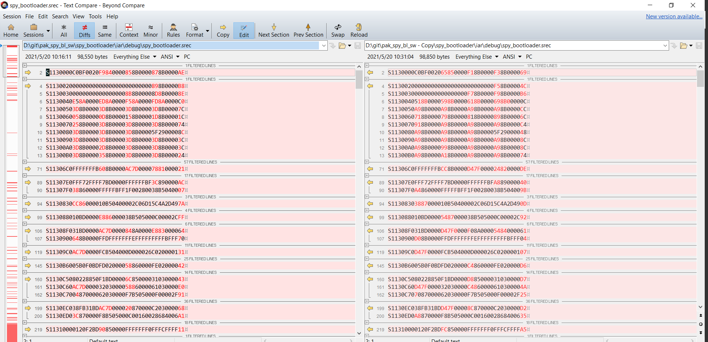
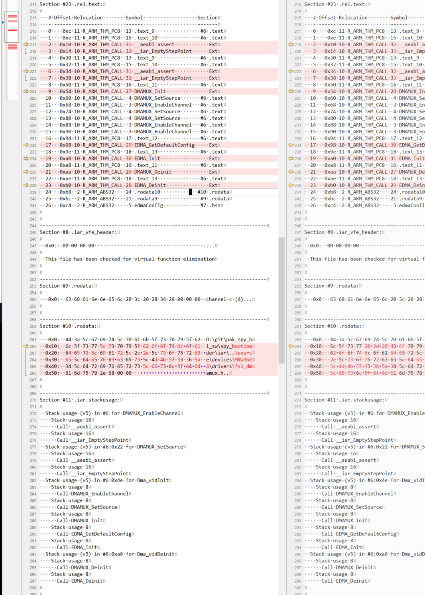
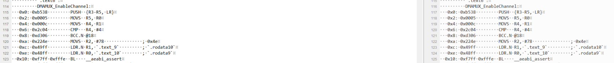
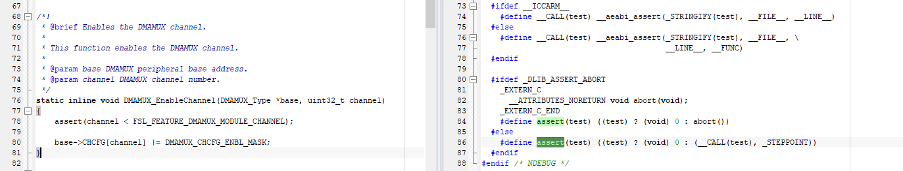
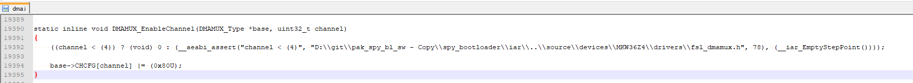

# Binary is different while building with same code

## Background:

Delivery audit is needed , when release a new software version . Auditor(quality) will check documentation/proof provided by software team according to a checklist.  

One item in the checklist is to check the binary can be reproduced by different engineer in different enviroment/laptop.It is a basic requirement for binary consistency .

## What I am observing:

Download same version(*version:357911a*) in different directory,I find the binary ,which is generated by IAR For ARM 8.50  ,  is not consistent.

## Expectaion:

It shall genearete same binary file in different enviroment.

## Analysis:

I am not famliar with the code(Because I am not responsible for this project).At First ,according to my experience, I serached the macro \_\_FILE\_\_ ,\_\_DATE\_\_ in the whole project. **But Nothing Found**.

Then I decide to start from one simple source file to find the difference.DMA.c is selected because its small scale .I dumped the object file of DMA.c :

Until now , Obviously , the cause can be located .The **Section #10 .rodata** ,which store file path , is invovled by interface aeabi_assert .
function aeabi_assert is called by DMAMUX_EnableChannel.

Return to function in DMAMUX_EnableChannel in source code:

It clearly invovle MACOR \_\_LINE\_\_ , \_\_FILE\_\_ ,.And pass those macros as parameter to function __aeabi_assert.

Function DMAMUX_EnableChannel after preprocessed :

And macro assert is defined in header file assert.h which is located in standard libary,So I missed it at the start when I search \_\_FILE\_\_ within the workspace. 

## Solution:

Enable **Release build configuration**(strongly recommand) or define macro **NDEBUG** to disable aeabi_assert.

