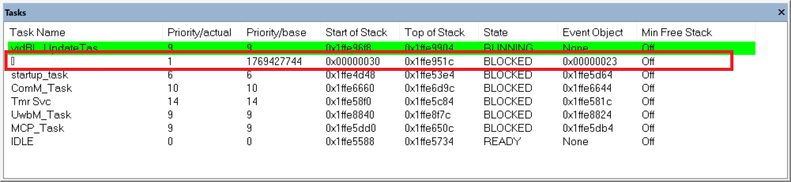
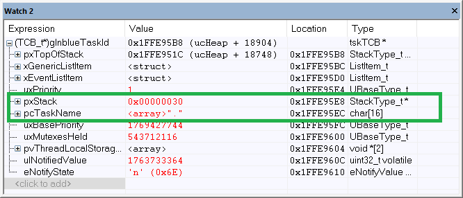
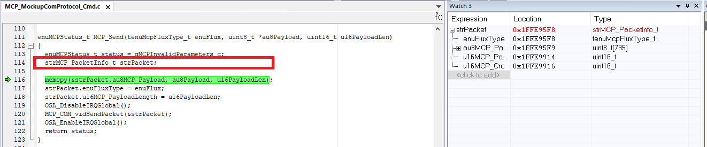

# Task Stack Overflow 
> Allocating a big size temporary variable within function causes stack overflow.

## Background
Some task TCB(task control block) will be overlapped after executing a specific shell command . 

### What I observed:   
  
|               |Normal|Exception|
|             -:|:-|:-|
|**TaskList**   |There are 8 tasks in the list.|**Inblue_task** disappeared
|**TCB**        ||

> TCB: Task Control Block . A struct type/handle in freertos to record the information of task .     

### Organize the task memory address information in one table:
  
|Task Name|Stack Start|Stack End|TCB Start|TCB End|
|-|-|-|-|-|
StartupTask|0x1FFE4D48|0x1FFE5510|0x1FFE5520|0x1FFE5578
IDLE|0x1FFE5588|0x1FFE5780|0x1FFE5790|0x1FFE57E8
TmrSvc|0x1FFE58F0|0x1FFE5CE8|0x1FFE5CF8|0x1FFE5D50
MCP_Task|0x1FFE5DD0|0x1FFE6598|0x1FFE65A8|0x1FFE6600
ComM_Task|0x1FFE6660|0x1FFE6E28|0x1FFE6E38|0x1FFE6E90
UwbM_Task|0x1FFE8840|0x1FFE9008|0x1FFE9018|0x1FFE9070
InblueTask|0x1FFE9100|0x1FFE95A8|0x1FFE95B8|0x1FFE9610
vidBL_UpdateTask|0x1FFE96F8|0x1FFE9948|0x1FFE9958|0x1FFE99B0

## Analyse:

- Create a data breakpoint to locate the position where overwrite the task TCB memory:

- Run the program and execute the shell command
- Program stopped:
  
 Until now , I reproduce the issue . and let's start to analyse the context where the program stopped.

 From the disassembly windows , we can see :
 - According to callstack , vidBL_UpdateTask is running
 - The program stop after pushing {R3-R8,LR} to the stack (protect the caller's context)
 - The SP pointer point to address **0x1ffe95e0** .   
   
 
 And it clearly shows that the operation of pushing register overwrites the TCB of InblueTask . But how does the stack pointer exceed stack range of itself ? And Continue to analyse the callers.
 The top of the call stack is vidBL_UpdateTask.Thanks to the powerful GUI of IAR , When  clicking the function name in call stack window , we can see the register value under the function you select.   

 ||Caller vidBL_UpdateTask| Caller MCP_Send|
 |:-:|:-:|:-:|
 ||||
 | Stack pointer value | **0x1ffe9930** | **0x1ffe95f8** |

Until now we can make a conclusion that: the stack pointer point to a address(**0x1ffe95f8**) out of its range(**[0x1ffe96f8**,**0x1ffe99b0]**) when entering function MCP_Send . And we can put our attention on function MCP_Send.
Assembly code of function MCP_Send:    

At the start of function MCP_Send, we can see that it reserves ***800 bytes*** for local variables .

Toggle a breakpoint here to execute step by step,and we can see that :

||Before|After|
|-|:-:|:-:|
||||
|Stack pointer value|**0x1ffe9918**|**0x1ffe95f8**|

Back to the source code ,and we can see coder allocate a temporary variable with 800 Bytes in function ***MCP_Send***.It is indeed a worse practice.

The variable allocation causes task stack overflow.

## Solution
### As in this case
 Function MCP_Send is a public interface and called in a high frequency.So I decide to move it a global variable in this module .

### As to avoid same issue 
- I dump all of the code section from the ELF and filter out the stack allocation instruction and to review all of bigger size stack allocation .
   > 
   
- Run the stack monitor function to check the stack usage in realtime.

