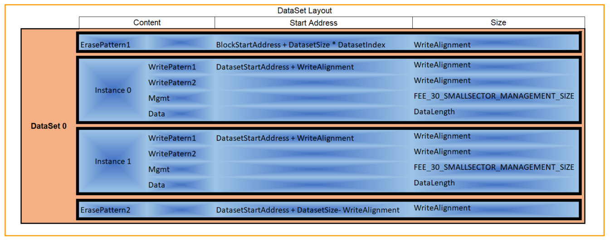
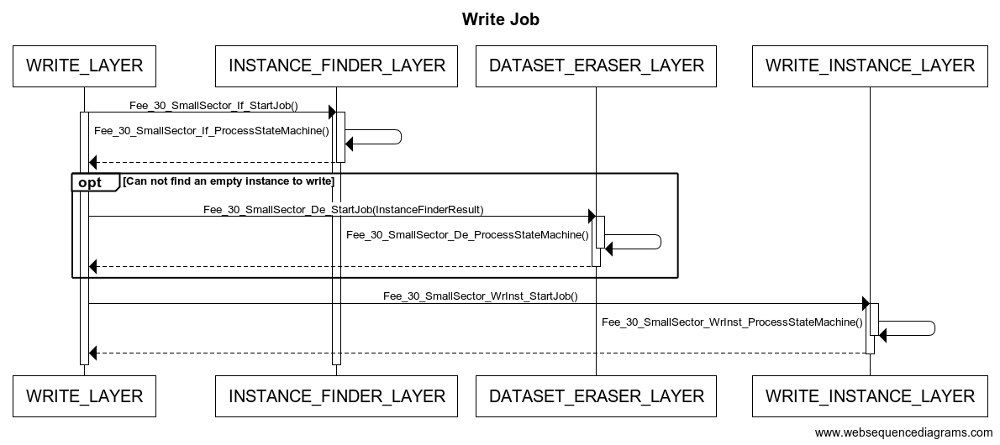
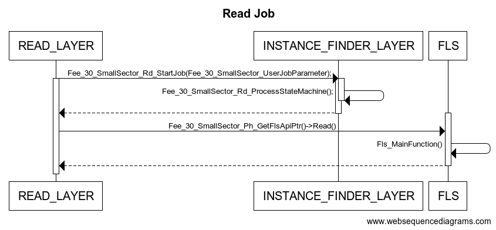

# FEE Layer
## Memory Layout
The dataset memory layout:

 

Each nv block corresponds to a ***dataset***.Each ***dataset*** includes numbers of instances(the instance number is equal to expected_write_cycles/flash_maximum_erase_cycles).

## Write Job     
 Operations:
 - [1] EraseImmediateBlock  
 - [2] InvalidateBlock 
 - [3] Write       
   
call **Write Job** . 
 

## Read Job
Operation read calls **Read Job**.
