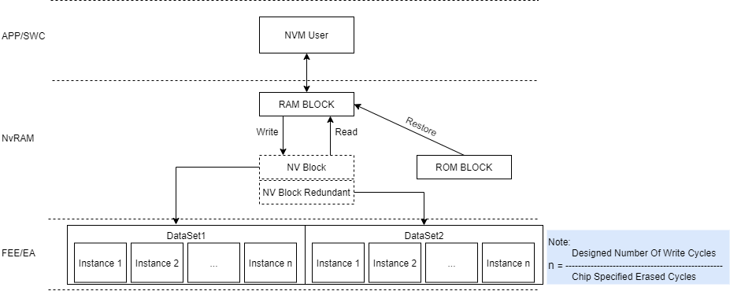

# Memory Stack

## Architecture && Function Overview

|Abbreviation|Description|
|:-|:-|
|**NVM**|**NVRAM Manager**: [1] Provide services for NvM User   [2] Data integrity --CRC  [3] Data redundant --Store with two Nv Blocks  
|**MemIf**|**Memory Abstraction Interface**:  Interface Wrapper 
|**FEE**|**Flash EEPROM Emulation**:  [1] Virtual/Physical address mapping [2] Unlimited writing  [3] On-Chip/Off-Chip abstraction |

     

## Data Unit In Each Layer
|Module|Data Unit|
|:-|:-|
|**NvM**|[1] NV RAM: store data in ram   [2] NV ROM: default value resides in ROM  [3] NV Block: a logic block |
|**FEE**||
|**FLS**||

## Detail 
- [NVRAM Manager](NVM.md)
<!--- - [Flash Emulation EEPROM](FEE.md)
-->

## Reference  
- [Vector Standard Fee and Small Fee](https://support.vector.com/kb?id=kb_article_view&sysparm_article=KB0012027&sys_kb_id=8c2582281b2614148e9a535c2e4bcbe8&spa=1)
- [How to Share Memory Blocks Between Application and Bootloader
](https://support.vector.com/kb?id=kb_article_view&sysparm_article=KB0011911&sys_kb_id=86154ee41b2614148e9a535c2e4bcbab&spa=1)
