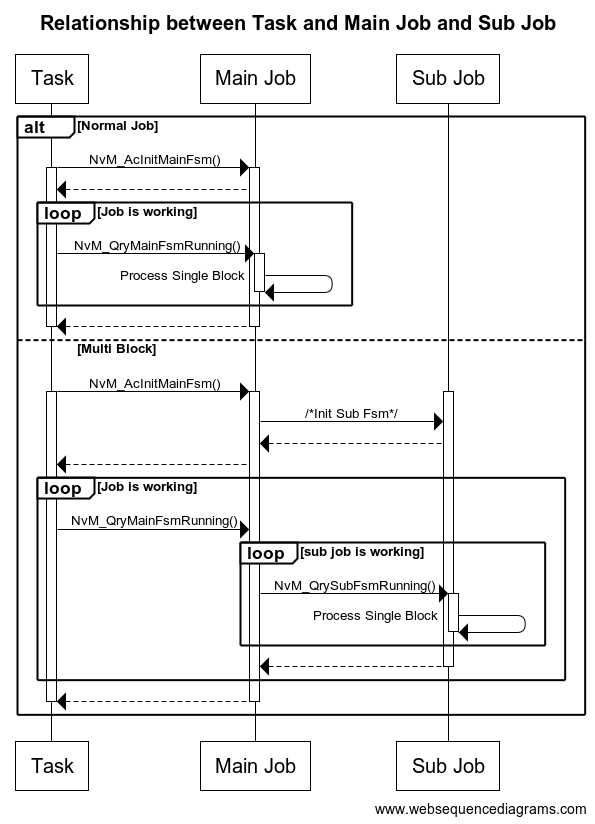
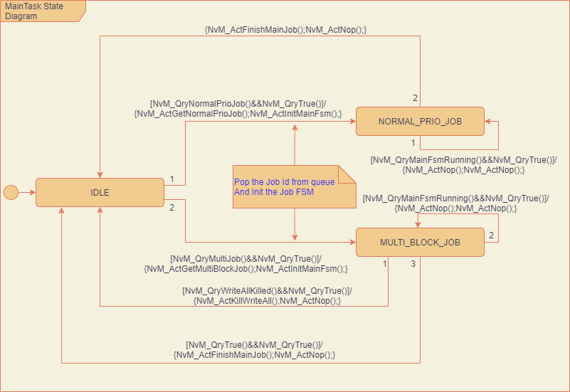
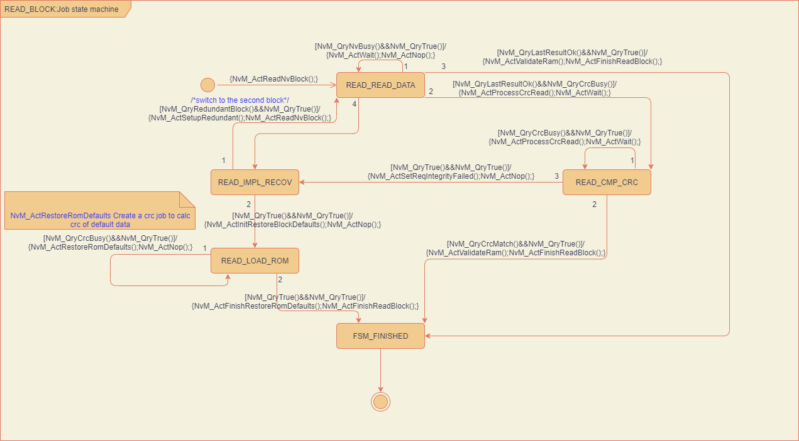
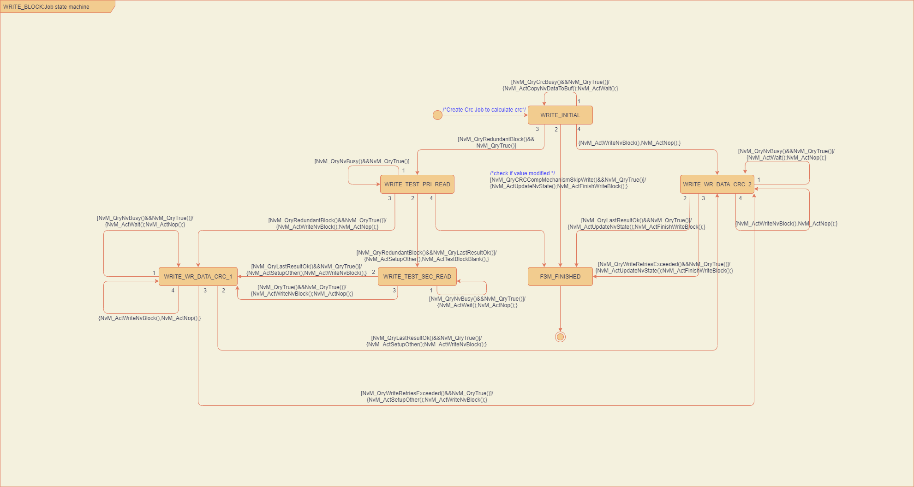
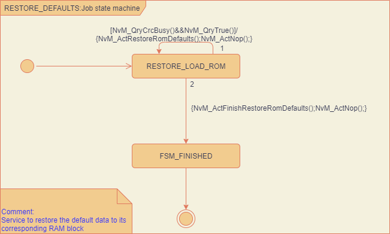
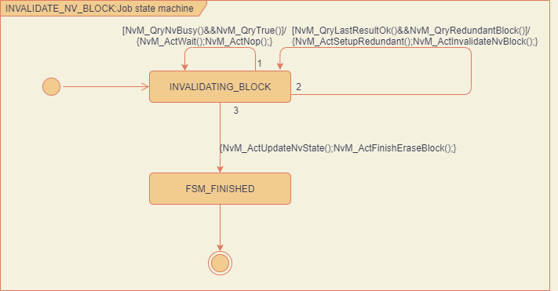
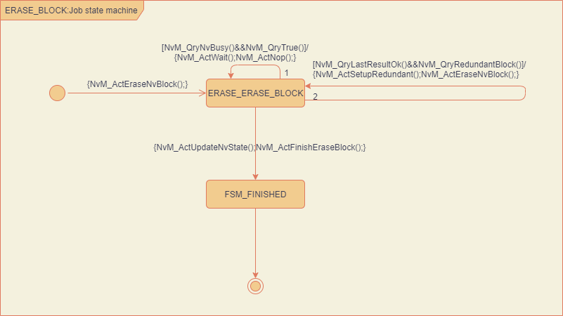
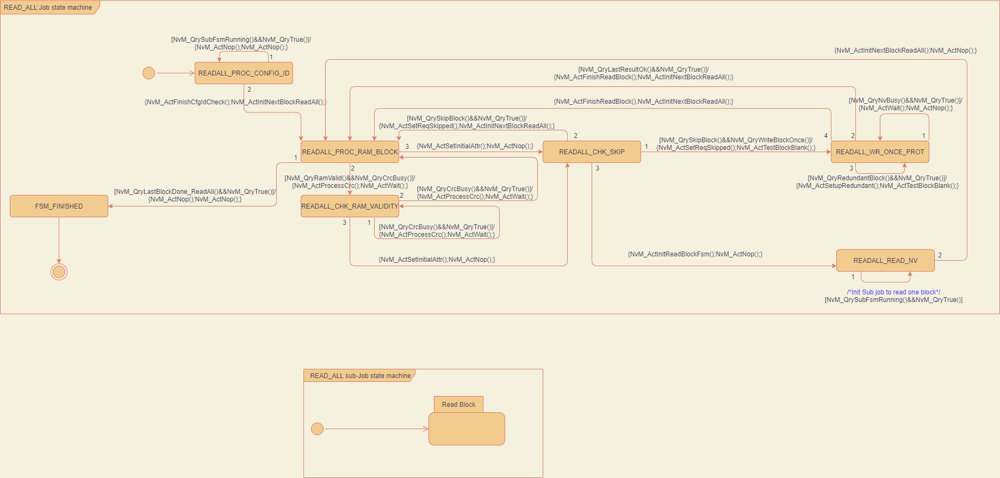
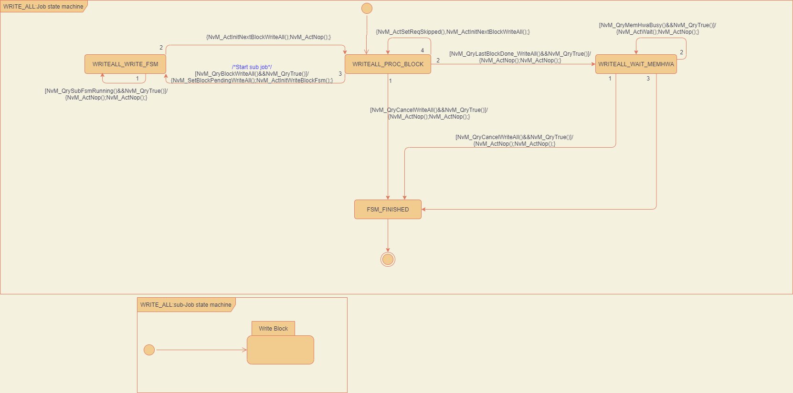

NvRam Manager provides many services for NvM user , and I will focus on the services commonly used :  
- Read block
- Write block
- Restore defaults
- Invalidate Nv Block
- Erase Block
- Read All
- Write All

There are 3 executors running in NvM layer to process the service request from NvM user: 
- Task
- Main Job
- Sub Job  

And they are scheduled in cascade: 

  
## NvM - Task 
NvM user requests service by push service to a queue.
Task takes responsibility to pop service from queue and starts the job to process the service request  . 
 
If the request is to process only one block ，the **Normal Job** will be executed ,otherwise the **Multi block job** will be executed.

## NvM - Job 
### Normal Priority Job  
- Read Block 
  
- Write Block  
  
- Restore Default  
 
- Invalidate Nv Block  
  
- Erase Block
  

### Multi block job  
- Read All  
   

- Write All   
  

